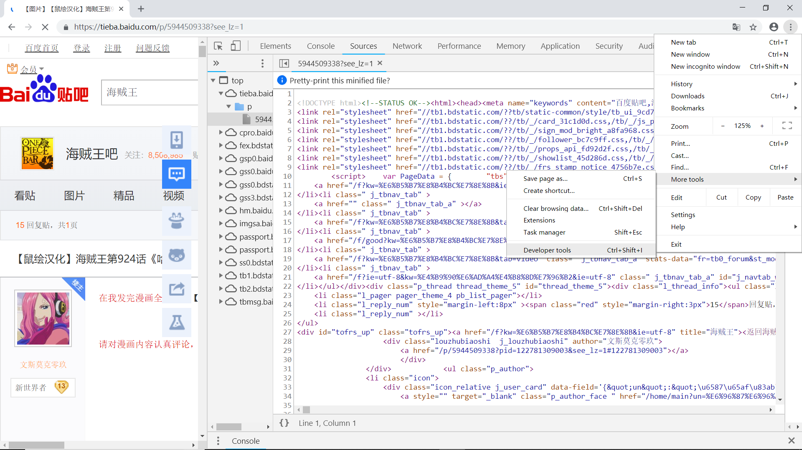

前置知识:python基本语法

python版本:python3.7.1 

使用工具:[PyCharm](https://baike.baidu.com/item/PyCharm/8143824?fr=aladdin)  [Chrome](https://baike.baidu.com/item/Google%20Chrome/5638378?fromtitle=Chrome&fromid=5633839) 

可以通过 [我的github主页](https://github.com/showmetheflowers/learn_python_crawler) 获取源码

---

~~众所周知，将大象放入冰箱只需要三步~~，同样通过python爬取百度贴吧图片也只需三步

1. 分析并获取目标网页的URL
2. 下载该网页源代码
3. 获取其中有用信息

**接下来以爬取海贼王第923话的帖子为例**

原贴URL:https://tieba.baidu.com/p/5934835791

---

**分析并获取目标网页的URL**

经常玩贴吧的朋友都知道贴吧有两个简单实用的功能

1. 只看楼主
2. 分页   

如果细心观察你会发现，当我们只看楼主时，URL变成了 https://tieba.baidu.com/p/5934835791?see_lz=1，并且只要输入上述URL就可以进入该网站,并不需要登录，新的URL与旧的只差一个see_lz=1，因此可以大胆猜测当see_lz=1时实现只看楼主功能。同理当我们进入不同页码的页面时也只是在原URL上添加了些许参数，这里不再赘述。

**下载该网页源代码**

了解过[HTML](http://www.runoob.com/html/html-tutorial.html)的朋友一定知道我们所看到的网页内容实质上是一堆代码，而浏览器正是通过这些代码将页面展示给用户。

通过Chrome我们可以获取网页的源代码。首先通过Chrome浏览器进入https://tieba.baidu.com/p/5934835791?see_lz=1，使用开发者工具进入源代码界面，你将看到如下界面



而通过python的urllib.request模块，我们可以很轻松的将网页的源代码下载到网页(仅限静态网页)

**获取其中有用信息**

我们的主题是爬取贴吧的图片，因此我们首先要获取图片的URL，而图片的URL就在上文中提到的网页源代码中。来看这段代码

```python
import urllib.request
import os  # 在之后用到
import re  # 在之后用到
url = "https://tieba.baidu.com/p/5934835791?see_lz=1"  # 目标网页URL
request = urllib.request.Request(url)  # 构造Request对象
response = urllib.request.urlopen(request)  # 打开此网页并返回给response
```

[官方urllib.request文档](https://docs.python.org/3.7/library/urllib.request.html?highlight=urllib%20request#module-urllib.request) urllib.request模块的urlopen方法接受的第一个参数可以是一个URL也可以是一个Request对象，上方代码采用后者。urlopen方法返回一个对象，此对象就可以像一个文件一样使用read方法获取其中内容

```python
res = response.read().decode("utf-8") 
```

由于read方法返回的是bytes类型的数据，我们再使用decode方法将其转化成utf-8格式，以便后续处理。

现在我们已经获得了网页的源代码，接下来就是从中找到图片的链接，使用Chrome浏览器的开发者工具打开网页后，按下 **ctrl**+**F**可以快速搜索你想找的字符串。在 HTML 中，图像由[&lt;img&gt;](http://www.runoob.com/html/html-images.html)标签定义:

&lt;img  src="相应图片的URL"&gt; 只要获得相应图片的URL，我们就可以通过python将其下载到我们的电脑上。

所以离爬取百度贴吧图片只差一步:从已获取的网页源代码中筛选出图片链接。那就一个个在源代码中找好了，python的[re](https://docs.python.org/3.7/library/re.html?highlight=re#module-re)模块很容易就能做到(至于正则的使用请自行搜索)

```python
pattern = '(<img class="BDE_Image".*?)(src=")(.+?jpg)' 
imgs = re.findall(pattern, res) # 别忘了import re 
```

[re.findall](https://docs.python.org/3.7/library/re.html?highlight=re%20findall#re.findall) 返回一个列表，用官方文档的原话就是：

Return all non-overlapping matches of *pattern* in *string*, as a list of strings.

获得了图片的URL后下一步就是下载到本地，当然我们不需要自己一个个点过去，使用python的[os](https://docs.python.org/3.7/library/os.html?highlight=os#module-os)中的makedirs方法创建文件并下载即可

```python
filename = r'W:\python3爬取百度贴吧图片\onepiece' # 输入你想下载到的位置
os.makedirs(filename)   #  创建文件
idx = 1
for img in imgs: # 从获取的图片URL中下载图片
    print('one piece', idx, 'is downloading')
    img = urllib.request.urlopen(img[2]).read() 
    img_file = filename + '\\' + str(idx) + '.jpg' # 为下载的图片命名
    idx = idx + 1 
    with open(img_file, 'wb') as f:
        f.write(img)
```

由于图像是以二进制存储的，上方代码第6行直接使用urlopen打开图片链接，使用read方法将图像存储在img中，至于为什么是img[2] 这是因为我使用的pattern是

```python
pattern = '(<img class="BDE_Image".*?)(src=")(.+?jpg)' 
```

re.findall方法返回的是一个列表，列表的每个元素都是一个元祖，而每个元祖的第三个元素即img[2]就是我们所需要的网页链接。(这要根据你自己的正则表达式决定）

短短二十多行代码就完成了爬取百度贴吧图片是不是很简单呢


**完整的程序代码**

```python
# coding:utf-8
import urllib.request
import re
import os
import timeit


class simple_crawler:
    def __init__(self, url, pattern):  # url:目标贴子的URL
        self.url = url                 # pattern:想抓取图片的正则
        self.pattern = pattern

    def get_page(self):
        request = urllib.request.Request(self.url)
        response = urllib.request.urlopen(request)
        print('get the source of web', self.url)
        return response

    def get_imgs_url(self):
        res = self.get_page().read().decode("utf-8")
        all_blank = '\n\r'
        for i in all_blank:  # 除去换行符
            res = res.replace(i, '')
        imgs = re.findall(self.pattern, res)
        print("get the img's url")
        return imgs

    def download_imgs(self, filename):
        try:
            os.makedirs(filename)  # 创建文件
            print('create file', filename)
        except OSError:
            print('OSError happened', filename, 'is exists')
        imgs = self.get_imgs_url()
        idx = 1
        for img in imgs:
            print('one piece', idx, 'is downloading')
            img = urllib.request.urlopen(img[2]).read()  # 此处的img[2]因为正则的第3个字符串是需要的网页
            img_file = filename + '\\' + str(idx) + '.jpg'
            idx = idx + 1
            with open(img_file, 'wb') as f:
                f.write(img)


url = "https://tieba.baidu.com/p/5934835791?see_lz=1"  # 目标网页URL
pattern = '(<img class="BDE_Image".*?)(src=")(.+?jpg)'
filename = r'W:\python3爬取百度贴吧图片\onepiece'  # 输入你想下载到的位置
ans = simple_crawler(url, pattern)
time1 = timeit.default_timer()
ans.download_imgs(filename)
time2 = timeit.default_timer()
print('the download took %d s' % (time2-time1))
```

