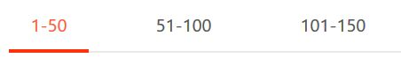
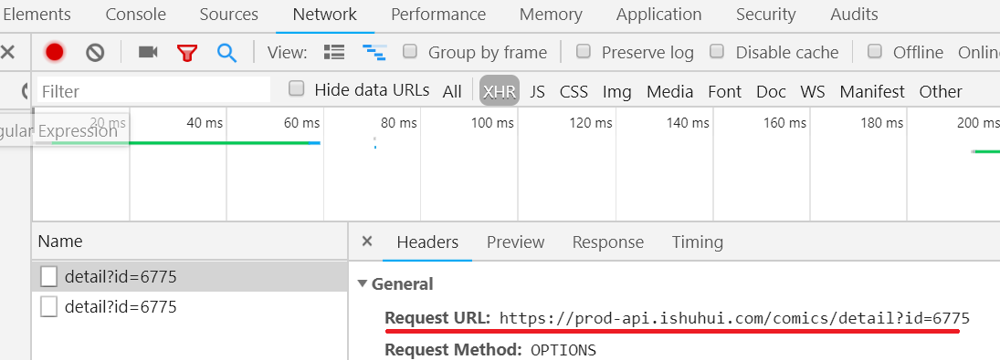
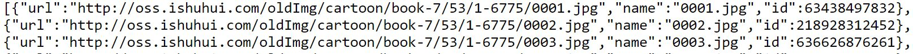
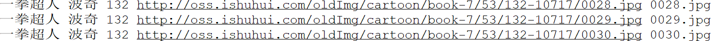
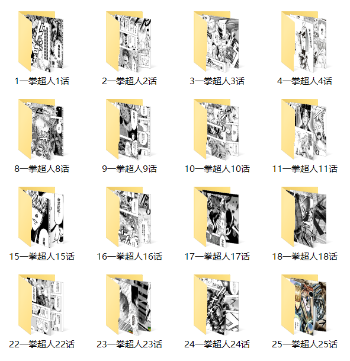

前置知识:python基础语法

python版本:python3.7.1

使用工具:[PyCharm](https://baike.baidu.com/item/PyCharm/8143824?fr=aladdin)  [Chrome](https://baike.baidu.com/item/Google%20Chrome/5638378?fromtitle=Chrome&fromid=5633839) 

主要使用的python模块: 1.urllib 2.selenium 3.json 4.re 5.os
***
<h2>以下内容仅供学习使用</h2>
**以爬取漫画[一拳超人](https://www.ishuhui.com/comics/anime/53)为例** 

1. 获取每一话的URL并下载到本地

2. 获取所有图片的URL并下载到本地

3. 依次下载所有图片到本地 

4. 下述所有代码默认已经 

  ```python
  # coding:utf-8
  import urllib.request
  from selenium import webdriver
  import re
  import json
  import os
  import timeit
  ```
***

**问题分析**

首先通过Chrome浏览器进入[一拳超人漫画首页](https://www.ishuhui.com/comics/anime/53) ，首先查看网页源代码，发现网页是**动态加载**的，所以之前通过直接获取源代码再提取出目标URL的方法失效了。因此我们需要使用python的一个第三方模块selenium，请自行pip安装。这里给出[selenium的官方文档](https://selenium-python.readthedocs.io/)。下载相应的**浏览器的驱动时注意与浏览器版本对应** ，**且确保浏览器的驱动安装在python虚拟环境的Scripts文件夹下**。

通过selenium打开浏览器进入一拳超人首页，通过find_elements_by_css_selector和find_elements_by_class_name方法定位到相应的按钮，点击后将每一话的URL下载到本地



获取了每一话的URL后，发现每一话的内容同样是**动态加载**的，但是通过Chrome的开发者工具的Network -> XHR -> Headers我们发现了下图中划红线部分的URL


打开<https://prod-api.ishuhui.com/comics/detail?id=6775>我们可以看到一堆如下图的URL



再打开其中的URL，发现这就是这一话所有图片的URL！
那么一切都变的简单了，只要获取<https://prod-api.ishuhui.com/comics/detail?id=6775>中**id部分**的取值，我们就找到了包含每一话所有图片链接的URL。

**下述所有代码默认的文件结构**（W磁盘下有漫画，尾缀，URL三个文件夹)
--W:
​    |--漫画
​    |--尾缀
​    |--URL

**获取每一话的对应的id取值**

下述代码的中心思想就是

1. 通过selenium模块自动打开对应漫画的URL主页

2. 使用find_elements_by_css_selector先定位到页码导航栏的整体位置和find_elements_by_class_name定位到每一个按钮。

3. 然后通过click方法点击按钮，使用page_source方法获取源代码(已经动态加载好的)。

4. 最后通过re.findall方法将其中的URL提取出来  

```python
def get_all_url(base_url, pattern, filename):#获取每一话的id
	"""参数1漫画首页URL 参数2漫画每一话URL的正则 参数3存放的文件地址"""
    driver = webdriver.Chrome()  # 打开Chrome浏览器
    driver.get(base_url)    # 打开对应漫画首页URL
    ans = []         # ans存放url的尾缀   
    all_content = driver.find_elements_by_css_selector('.ant-tabs-nav.ant-tabs-nav-animated')  
    content = all_content[1].find_elements_by_class_name('ant-tabs-tab')
    for i in range(0, len(content)):
        if content[i].text == "": # 若按钮不存在则退出
            break
        content[i].click()   # 点击相应按钮
        page = driver.page_source  # 获取包含每一话url的源代码
        print('page=', page)
        partial_url = re.findall(pattern, page)#匹配源代码中的url
        ans.append(partial_url) # 添加url到ans列表
    driver.close() # 关闭Chrome浏览器
    all_url = set() 
    for i in ans:  # 将ans去重保存在all_url集合
        for j in i:
            all_url.add(j[1])
    with open(filename, 'wb+') as f: #写入到filename中
        for i in all_url:
            print(i, ' is downloading')
            f.write(i.encode())
            f.write('\n'.encode())
    return filename     # 返回存储尾缀的文件地址


if __name__ == '__main__':
    url = 'https://www.ishuhui.com/comics/anime/53'
    pattern = r'(comics.detail.(.*?))"'
    filename = 'W:\\漫画\\尾缀\\一拳超人.txt'
    get_all_url(url, pattern, filename)
```
运行后漫画每一话的URL保存在W:\漫画\尾缀\一拳超人.txt

**获取所有图片的URL**

获取所有图片的URL以及相关信息方便后续

```python
def get_num(filename):          #  获取每一话的url尾缀的集合
    with open(filename, 'rb') as f:
        res = f.read().decode()
    ans = res.split('\n')
    return ans

def get_all_img_url(base_url, download_filename, num_filename):
    """参数1 存储json格式数据的URL 参数2 所有图片URL的保存地址 参数3 保存每一话URL的文件地址"""
    num_set = get_num(num_filename)   # 获取每一话的url尾缀的集合
    cnt = 0
    for i in num_set:
        if i == "":     # 最后一个""直接退出
            break
        url = base_url.format(i)  # 获取一话的url
        imgs = urllib.request.urlopen(url)  # 获取对应url数据
        tmp_dict = json.loads(imgs.read())  # 将获取的json格式数据转化成python对应的数据类型
        # print(tmp_dict)
        data = tmp_dict['data']             # 获取漫画的主要信息
        anime_name = data['animeName']+" "  # 获取漫画的名称
        anime_title = data['title']+" "     # 获取漫画的话标题
        anime_num = str(data['numberStart'])+" "  # 获取漫画的话号
        url_list = data['contentImg']  # 获取这一话所有图片的url组成的列表
        for j in url_list:  # 对这一话所有图片的url组成的列表遍历，写入对应文件
            text = anime_name+anime_title+anime_num+j['url']+" "+j['name']+'\n'
            with open(download_filename, 'ab') as f:
                f.write(text.encode())
        cnt = cnt+1
        print("No."+str(cnt)+" "+anime_num+anime_title+'has downloaded') # 每下载好一话输出确认信息
    return download_filename  # 返回保存URL的文件的地址


if __name__ == '__main__':
    #存储每一话所有图片的URL 填充不同id值即可找到所有图片URL
    base_url = 'https://prod-api.ishuhui.com/comics/detail?id={}'  
    download_filename = 'W:\\漫画\\URL\\一拳超人URL.txt'
    num_filename = 'W:\\漫画\\尾缀\\一拳超人.txt'
    get_all_img_url(base_url, download_filename, num_filename)
```
运行程序所有图片的URL保存到W:\漫画\URL\一拳超人URL.txt

**下载所有图片到本地**

到这里离成功只差一步了：从所有图片URL下载图片到本地。但这里存在几个问题

1. 保存在一拳超人URL.txt中的除了图片的URL还有其他信息  
    
在处理过程中，可能出现URL无法正常打开，为了使程序正常运行，下述程序在无法打开图片URL时会记录下相应的数据，并继续执行

2. 若程序中途出现其他错误，异常退出，调试后重新运行。为了避免重复下载已经下载好的图片，下述程序通过os.path.exists方法判断图片不存在时再下载

```python
def get_imgs(source_file, base_download_file):
    """参数1 保存URL文件的地址 参数2 保存图片的地址"""
    try:
        os.makedirs(base_download_file)
    except OSError:
        pass
    with open(source_file, 'rb') as f:
        while True:  # 遍历source_file的每一行提取出url和文件名称直到最后一行为止
            # cnt = cnt + 1
            line = f.readline().decode()
            # print(line)
            if line:
                items = line.split(' ')
                #print(items)
                new_items = items[2] + items[1]
                img_id = items[4].split('\n')[0]  # 每张图片的名称
                img_url = items[3]
                file = base_download_file + "\\" + new_items  # 每一话存储的目录
                img_file = file + "\\" + img_id
                if os.path.exists(img_file):  # 如果文件存在跳过此次循环
                    print(img_file, ' exists')
                    continue
                try:     # 尝试下载图片
                    img = urllib.request.urlopen(img_url).read()  # 此函数中这里最花时间
                except:   # 若下载出现错误则记录在指定文件并继续下载
                    with open(base_download_file+'错误记录.txt', 'ab') as error_file:
                        error_file.write(line.encode())     # 记录出现错误的行
                        error_file.write(img_url.encode())  # 记录出现错误的url
                    continue
                try:
                    os.makedirs(file)
                    # print('W:\\爬取一拳超人\\下载结果\\'+new_items)
                except OSError:
                    pass
                with open(img_file, 'wb') as g:
                    g.write(img)
                    print(new_items +" No."+img_id, 'has download')
            else:
                break


if __name__ == '__main__':
    source_file = 'W:\\漫画\\URL\\一拳超人URL.txt'
    base_download_file = 'W:\\漫画\\一拳超人'
    get_imgs(source_file, base_download_file)
```

运行程序，所有图片保存在W:\\漫画\\一拳超人

**一键下载漫画到本地**

下述get_all_url函数在get_total_url.py内

get_all_img_url函数在get_imgs_url.py内

get_imgs函数在get_imgs.py内

且所有.py文件在同一目录下

```python
# coding:utf-8
import urllib.request
from selenium import webdriver
import re
import json
import os
import timeit
from get_total_url import get_all_url
from get_imgs_url import get_all_img_url
from get_imgs import get_imgs
# 计时开始
time1 = timeit.default_timer()
# 下载每一话的URL
name = '一拳超人'
url = 'https://www.ishuhui.com/comics/anime/53'   # 对应漫画主页URL
pattern = r'(comics.detail.(.*?))"'
filename = 'W:\\漫画\\尾缀\\'+name+'.txt'
num_filename = get_all_url(url, pattern, filename)  
# 下载所有图片的URL
base_url = 'https://prod-api.ishuhui.com/comics/detail?id={}'
download_filename = 'W:\\漫画\\URL\\'+name+'URL.txt'
source_file = get_all_img_url(base_url, download_filename, num_filename)
# 下载所有图片
base_download_file = 'W:\\漫画\\'+name
get_imgs(source_file, base_download_file)
# 计时结束
time2 = timeit.default_timer()
print('the download took %d s' % (time2-time1))
```

最后展示一下部分结果


