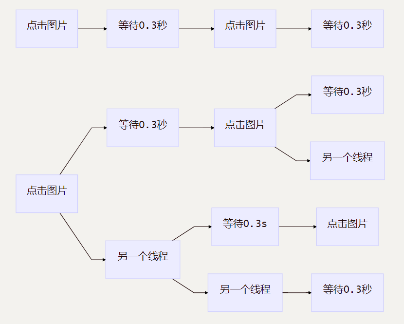

在上一篇 [爬取腾讯动漫海贼王](https://www.relight.net/python/3) 中，用了大概3小时使用selenium爬取了2万条图片URL。那么有什么好方法能缩短时间呢？下面通过**python的多线程**改写之前的程序使得完成时间大大缩短。

前置知识:阅读 [爬取腾讯动漫海贼王](https://www.relight.net/python/3)

python版本:python3.7.1

主要使用的python模块: 1.threading 2.queue 3. selenium 4. re

本文参考了[Effective Python](https://book.douban.com/subject/26709315/) 中的第37条

可以通过 [我的github主页](https://github.com/showmetheflowers/learn_python_crawler) 获取源码 **或和我讨论交流**

  **python多线程**

首先需要明确由于python的GIL(global interpreter lock 全局解释器锁)的限制，python标准的Thread类的多线程**在同一时刻实际上只能有一个线程**在执行。

因此如果想用python的多线程进行**平行计算**，结果会令人失望。

但是若果处理的是**阻塞式的I/O操作**，会很好的加快程序的执行速度。

读写文件、在网络间通信、以及与显示器等设备交互都属于阻塞时I/O操作。在**等待响应**的时候，我们可以借助多线程执行其他操作。

**代码分析**

上一篇文章爬取海贼王漫画的代码是使用selenium模拟浏览器打开网页，并依次点击每张图片，再执行time.sleep(0.3)时等待0.3秒来加载图片。这**0.3秒就是等待响应的时间** ，下面分析下列循环

```python
for i in ans:
    try:
        i.click()    # 点击 滚动条滚动到相应图片并加载
    except:
        time.sleep(0.3) # 等待图片加载完成
```

下图中第一个流程图是单进程时的程序流程图

可以看到在执行 time.sleep(0.3)时，**白白浪费了CPU资源**

下图中的第二个流程图是在多线程的条件下执行。多个线程**并发**(concurrency)执行。**在一个线程等待0.3秒时，阻塞该线程，系统调用另一线程执行**。很好的利用了CPU。python线程在执行系统调用的时候会释放GIL，并且一直等到执行完毕才会重新获取它，所以GIL是不会影响系统调用的。



**代码改写**

首先使用python的threading模块中的[Thread](https://docs.python.org/3.7/library/threading.html?highlight=threading#module-threading)类和queue模块中的[Queue类](https://docs.python.org/3.7/library/queue.html?highlight=queu#module-queue)，Queue类实现了安全的数据交换和锁机制，可以确保线程正常的获取队列中的数据。

所以一个很简单的思路就是将1至693入队，然后线程每次从队列中获取一个数字，组成海贼王漫画每一话的URL，只需稍微修改下原先单进程版本的代码，便可完成。下述代码推荐使用**selenium的无界面模式**，这样CPU占用会低很多。selenium的有界面模式在线程数较多时，CPU占用过高.

```python
# coding:utf-8
from selenium import webdriver
import re
import time
import timeit
import threading
import queue


def get_img_url(base_url, save_file, idx, driver):
    url = base_url.format(idx)
    driver.get(url)
    content = driver.find_elements_by_class_name('comic-contain')  # 定位到主体漫画部分
    if not content:  # 如果没有定位到说明此URL没有所需内容直接跳过
        pass
    else:  # 如果链接存在继续运行
        print('downloading')
        ans = content[0].find_elements_by_class_name('comic-text')  # 定位这一话中每一张图片
        for i in ans:
            try:
                i.click()    # 点击 滚动条滚动到相应图片并加载
            except:
                time.sleep(0.3)  # 等待图片加载完成
        time.sleep(0.3)  # 最后等待一会 等待图片加载完成
        page = driver.page_source
        imgs = re.findall(pattern, page)
        tmptitle = re.search(tpattern, page)
        title = tmptitle[1].replace(' ', '')   # 获取话标题
        with open(save_file, 'ab') as f: # 将URL及话标题存入相应文件
            cnt = 1
            f.write((title+'\n').encode())
            for img_url in imgs:
                res = img_url + "," + str(cnt) + '\n'
                f.write(res.encode())
                cnt = cnt + 1
        print(title, 'has downloaded')


class my_thread(threading.Thread):
    # def __init__(self):
    #     super().__init__() # 继承
    #     如果想给线程添加属性可加在此处

    def run(self):
        print(self.name, 'is running')
        # driver = webdriver.Chrome() # 使用此行 注释下面3行为有界面模式
        chrome_options = webdriver.ChromeOptions()  # 无界面模式
        chrome_options.add_argument('--headless')
        driver = webdriver.Chrome(options=chrome_options)  # 打开浏览器
        while not q.empty():
            print(self.name, 'is downloading')
            idx = q.get()
            get_img_url(base_url, save_file, idx,driver)
        driver.close() # 关闭浏览器


if __name__ == '__main__':
    threads = []
    q = queue.Queue()  # 创建队列
    for i in range(1, 100):  # 下载1到100话可自行设定
        q.put(i)
    pattern = '(manhua.qpic.cn/manhua_detail/0.*?.jpg/0)'
    tpattern = '<title>《航海王》(.*?)-'
    base_url = 'http://ac.qq.com/ComicView/index/id/505430/cid/{}'
    save_file = 'W:\\漫画\\URL\\测试\\temp.txt'  # 所有图片URL的保存地址，可自行修改
    time1 = timeit.default_timer()
    for i in range(2):   # 开启的线程数 可自行修改
        t = my_thread()  # 创建线程
        t.start()        # 开启线程并调用线程的run方法
        threads.append(t)  # 将线程加入队列threads
    for t in threads:
        t.join()   # 等待各个线程结束    
    time2 = timeit.default_timer()
    print('the download took %d s' % (time2-time1))
```

**效率分析**

在限定网速为1632KB/s时，测试不同线程数量的程序爬取前海贼王前100话URL的时间如下表(selenium都为无界面模式)，在5-线程时任务管理器显示CPU已经占100%

| 类型 | 时间 |
| :- | :-: |
| 单进程 | 823秒  |
| 2-线程 |  423秒  |
| 3-线程 |  315秒  |
| 4-线程 |  255秒  |
| 5-线程 |  235秒  |

可以明显看到爬取的速度大大提高了，对于这种阻塞式的I/O操作占用大量时间的程序中，多线程是提高程序速度的一个很好的手段。
