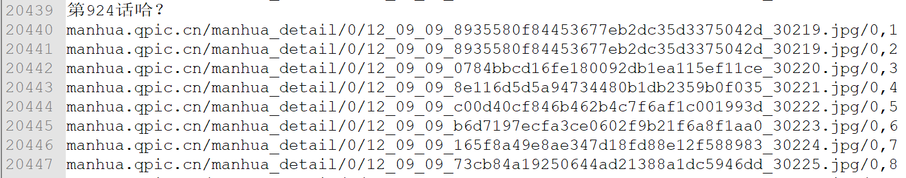
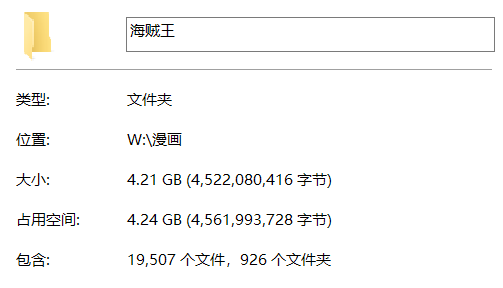

前置知识:python基础语法

python版本:python3.7.1

使用工具:[PyCharm](https://baike.baidu.com/item/PyCharm/8143824?fr=aladdin)  [Chrome](https://baike.baidu.com/item/Google%20Chrome/5638378?fromtitle=Chrome&fromid=5633839) 

主要使用的python模块: 1. selenium 2. re  
<h2>以下内容仅供学习使用</h2>
***

**以爬取腾讯动漫的 [海贼王](http://ac.qq.com/Comic/comicInfo/id/505430) 为例**

1. 通过Chrome浏览器发现网站中的图片是动态加载的，只有滚动条滚动到的图片才会加载，并且加载需要一定的时间。
2. 网站中每一话的URL有明显的规律，给出第一话的URLhttp://ac.qq.com/ComicView/index/id/505430/cid/1，只需改变最后一位的数字便能定位到每一话的URL

使用**selenium**模块仅需短短**五十行代码**就能就能获取海贼王每一张图片的URL。

亮代码前先说说这个方案的优缺点：

**优点**：逻辑简单，使用范围广，稍微修改下便能爬取腾讯动漫其它的免费内容
**缺点**：耗时较长，获取海贼王近两万张图片的URL要大概3小时 

**代码**  

主要思想就是使用selenium这个浏览器自动化测试框架，编写程序完成：

1. 打开每一话URL，操作滚动条，等待所有图片加载完成
2. 通过re模块提取其中每张图片的URL到本地      

给出 [selenium](https://seleniumhq.github.io/selenium/docs/api/py/index.html) 的文档，可供搜索各种方法的使用及源代码实现

顺便提醒安装相应浏览器驱动时要注意版本，并将驱动保存在python环境的Scripts目录下即可

**下述代码使用Chrome浏览器及相应驱动**

```python
# coding:utf-8
from selenium import webdriver
import re
import time
import timeit


def get_img_url(base_url, save_file):
    driver = webdriver.Chrome()  # 将此行注释 换成执行下面三行启用无界面模式
    # chrome_options = webdriver.ChromeOptions()  # 无界面模式
    # chrome_options.add_argument('--headless')
    # driver = webdriver.Chrome(options=chrome_options)  # 打开浏览器
    for idx in range(1, 693):   # 获取从第一话到最后一话的URL
        url = base_url.format(idx)
        driver.get(url)
        content = driver.find_elements_by_class_name('comic-contain')  # 定位到主体漫画部分
        if not content:  # 如果没有定位到说明此URL没有所需内容直接跳过
            continue
        else:
            print('downloading')
        ans = content[0].find_elements_by_class_name('comic-text')  # 定位这一话中每一张图片
        for i in ans:
            try:
                time.sleep(0.3)  # 等待图片加载完成
                i.click()    # 点击 滚动条滚动到相应图片并加载
            except:
                pass
        page = driver.page_source
        imgs = re.findall(pattern, page)
        tmptitle = re.search(tpattern, page)
        title = tmptitle[1].replace(' ', '')   # 获取话标题
        with open(save_file, 'ab') as f: # 将URL及话标题存入相应文件
            cnt = 1
            f.write((title+'\n').encode())
            for img_url in imgs:
                res = img_url + "," + str(cnt) + '\n'
                f.write(res.encode())
                cnt = cnt + 1
        print(title, 'has downloaded')
    driver.close()  # 关闭浏览器


pattern = '(manhua.qpic.cn/manhua_detail/0.*?.jpg/0)'
tpattern = '<title>《航海王》(.*?)-'
base_url = 'http://ac.qq.com/ComicView/index/id/505430/cid/{}'
save_file = 'W:\\漫画\\URL\\testt.txt' # 所有图片URL的保存地址，可自行修改
time1 = timeit.default_timer()
get_img_url(base_url, save_file)
time2 = timeit.default_timer()
print('the download took %d s' % (time2-time1))
```

**结果展示** 

部分获得的图片URL



再从各个图片URL将图片下载到本地，这步就不提供源代码了，通过urlopen即可完成



